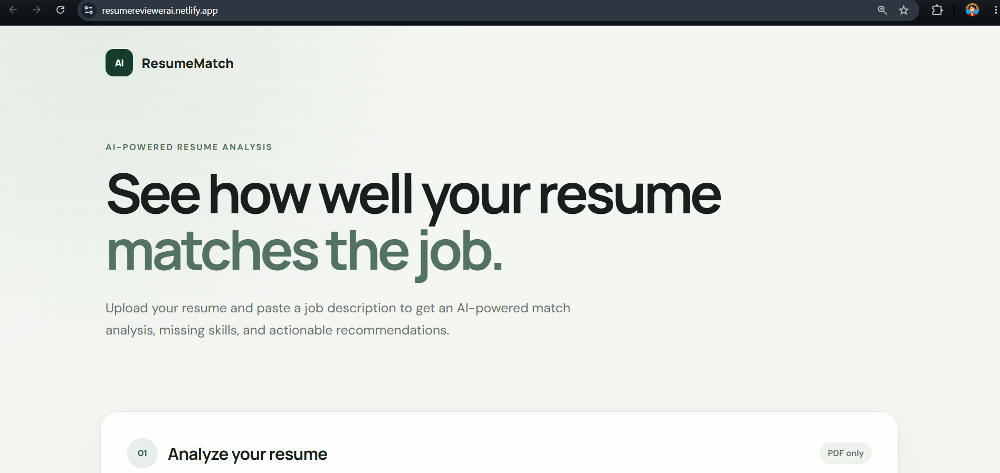
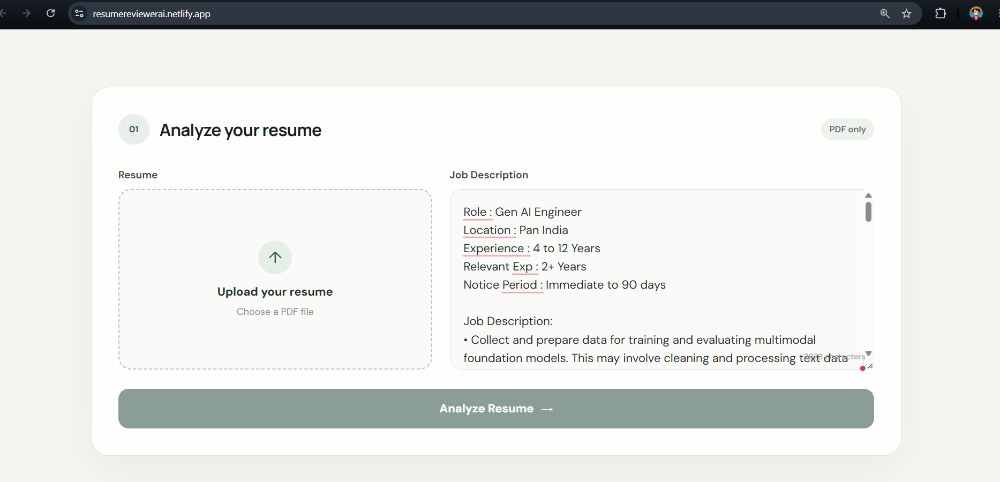
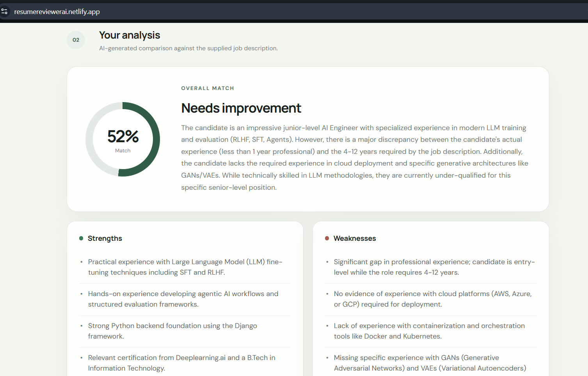
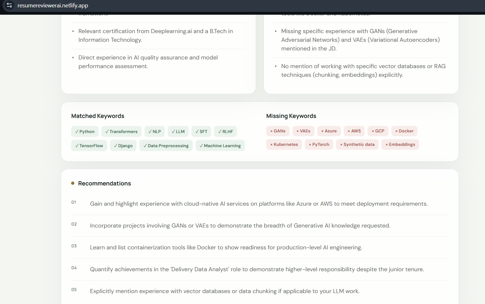

<div align="center">

# 🚀 ResumeMatch AI

### AI-Powered Resume Analyzer using React, FastAPI & Google Gemini

Compare your resume against any job description and receive an AI-generated ATS-style analysis including match score, strengths, weaknesses, missing skills, and personalized recommendations.

<br>

[](https://react.dev/)
[](https://fastapi.tiangolo.com/)
[](https://www.python.org/)
[](https://www.docker.com/)
[](https://ai.google.dev/)
[](https://www.netlify.com/)
[](https://render.com/)

</div>

---

# 🌐 Live Demo

### Frontend

https://resumereviewerai.netlify.app/

### Backend API

https://resume-reviewer-api-a9rp.onrender.com/docs

---

# ✨ Features

- 📄 Upload PDF resumes
- 💼 Compare against any Job Description
- 🤖 AI-powered resume analysis using Google Gemini
- 📊 ATS-style Match Score
- ✅ Strength Analysis
- ⚠️ Weakness Detection
- 🔍 Matched Keywords
- ❌ Missing Keywords
- 💡 Personalized Recommendations
- ⚡ FastAPI REST API
- 🐳 Dockerized Deployment

---

# 📷 Screenshots

## Landing Page



---

## Resume Upload



---

## AI Analysis



---

## Recommendations



---

# 🏗️ Architecture

```text
                  User
                    │
                    ▼
          React Frontend (Netlify)
                    │
              HTTPS Request
                    │
                    ▼
        FastAPI Backend (Render)
                    │
           Resume PDF Extraction
                    │
                    ▼
          Google Gemini API
                    │
         Structured AI Response
                    │
                    ▼
            ResumeMatch Results
```

---

# 🛠️ Tech Stack

## Frontend

- React
- Vite
- CSS
- Fetch API

## Backend

- FastAPI
- Python
- Pydantic

## AI

- Google Gemini API
- Prompt Engineering

## DevOps

- Docker
- Docker Compose
- Render
- Netlify

---

# 📂 Project Structure

```text
ai-resume-reviewer/
│
├── backend/
│   ├── main.py
│   ├── schemas.py
│   ├── services.py
│   ├── utils/
│   └── Dockerfile
│
├── frontend/
│   ├── src/
│   ├── public/
│   ├── package.json
│   └── vite.config.js
│
├── docs/
│   └── images/
│
├── docker-compose.yml
└── README.md
```

---

# 🚀 Running Locally

## Clone Repository

```bash
git clone https://github.com/Fayash30/ai-resume-reviewer.git

cd ai-resume-reviewer
```

---

## Backend Environment Variable

Create:

```text
backend/.env
```

```env
GEMINI_API_KEY=YOUR_GEMINI_API_KEY
```

---

## Frontend Environment Variable

Create:

```text
frontend/.env
```

```env
VITE_API_URL=http://localhost:8000
```

---

## Run with Docker

```bash
docker compose up --build
```

Frontend

```
http://localhost:5173
```

Backend

```
http://localhost:8000/docs
```

---

# 📡 API Endpoints

| Endpoint | Method | Description |
|----------|--------|-------------|
| `/review` | POST | Analyze Resume |
| `/health` | GET | Health Check |
| `/docs` | GET | Swagger UI |

---

# 🎯 Future Improvements

- Authentication
- Resume History
- Export Analysis as PDF
- Multiple Resume Comparison
- Support Multiple AI Models
- Resume Version Tracking
- ATS Benchmarking

---

# 📚 What I Learned

Building this project helped me gain hands-on experience with:

- Building REST APIs using FastAPI
- React frontend development
- Google Gemini API integration
- Prompt Engineering
- Docker & Docker Compose
- Cloud deployment (Render & Netlify)
- CORS configuration
- Environment variable management
- Production debugging
- Full-stack application deployment

---

# 📄 License

This project is licensed under the MIT License.

---

<div align="center">

### ⭐ If you found this project interesting, consider giving it a star!

Made with ❤️ using React, FastAPI & Google Gemini

</div>